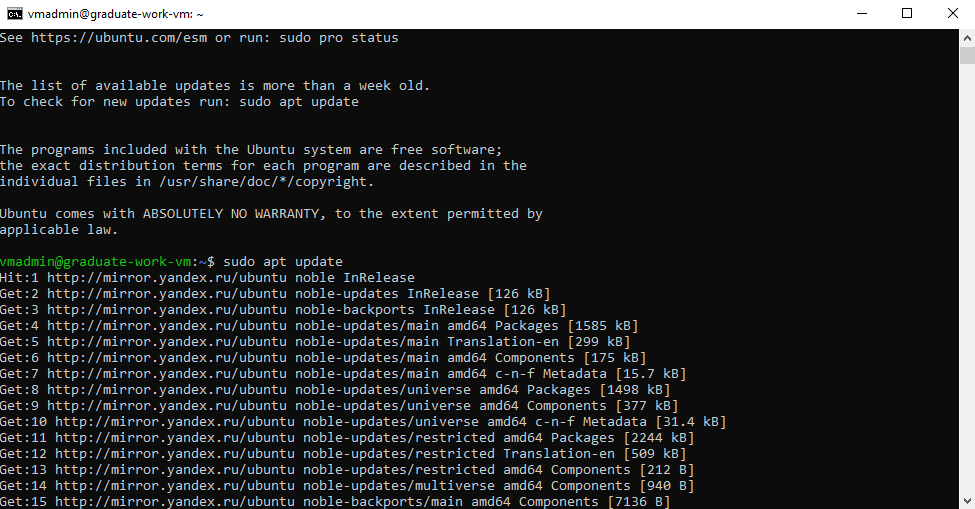
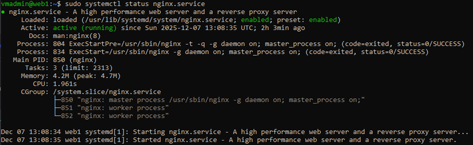
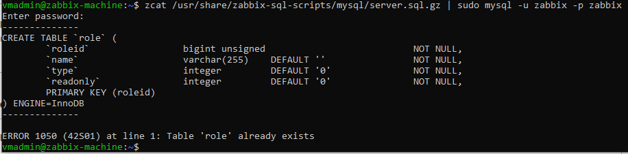
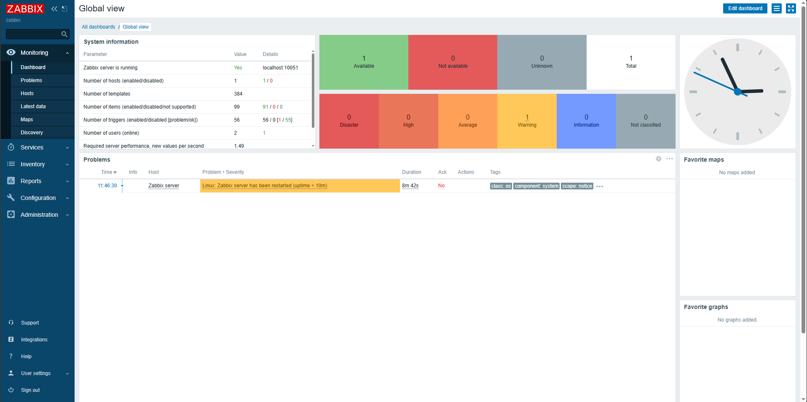
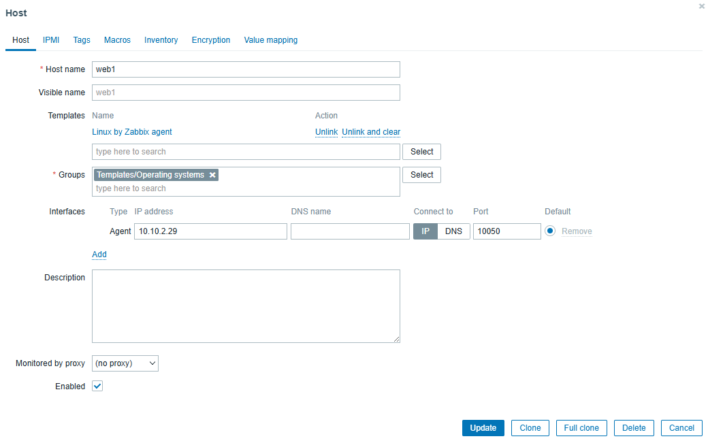
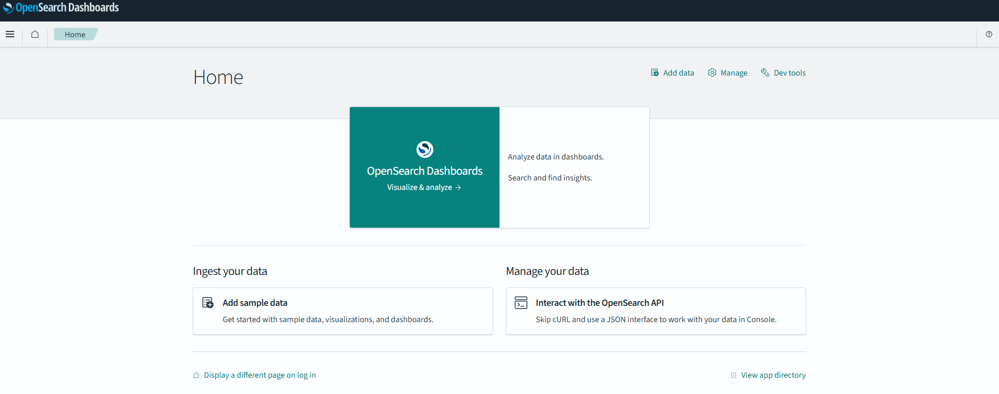
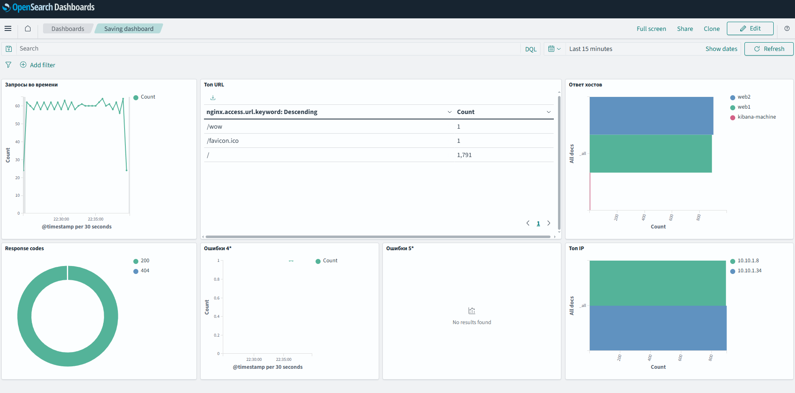
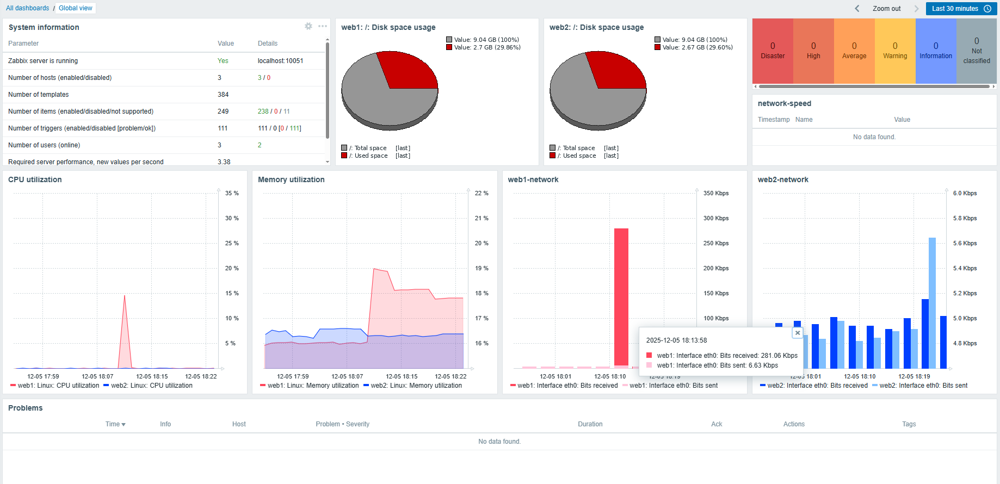

#  Дипломная работа по профессии «[Системный администратор](https://github.com/netology-code/sys-diplom/blob/diplom-zabbix/README.md)»
---

Создаём и подготавливаем ВМ [`bastion-vm`](Building_virtual_machines.md) <sub>Ранее: graduate-work-vm</sub> , она будет играть роль бастиона. 

Установка пакетов
```bash
sudo apt update
sudo apt upgrade
sudo apt install unzip wget git ansible
wget https://hashicorp-releases.yandexcloud.net/terraform/1.13.5/terraform_1.13.5_linux_amd64.zip
unzip terraform_1.13.5_linux_amd64.zip
sudo mv terraform /usr/local/bin/
```



Создание ключа-доступа для terraform
```bash
yc init
yc iam key create --service-account-id aj6***********lmj --output tf-key.json
chmod 600 tf-key.json
```
Создаём приватную подсеть [`private-subnet-a`](Creating_subnets.md) в зоне `ru-central1-a`
```
resource "yandex_vpc_subnet" "private_a" {
  name = "private-subnet-a"
  zone = "ru-central1-a"
  network_id = yandex_vpc_network.main.id
  v4_cidr_blocks = ["10.10.2.0/24"]
  route_table_id = yandex_vpc_route_table.private_routes.id
}
```
>Возникли трудности с ручным созданием подсети из-за маршрутизации по зоне `ru-central1-a`, поэтому создал подсеть напрямую через `yandex cloud` и импортировал её в `terraform`, это помогло решить проблему.

---

Добавляем NAT-шлюз, формируем таблицу маршрутов и привязываем её к приватной подсети в наш [`main.tf`](config/main.tf).
```hcl

resource "yandex_vpc_gateway" "nat_gateway" {
  name = "nat-gateway"
  shared_egress_gateway {}
}
resource "yandex_vpc_route_table" "private_routes" {
  name = "private-route-table"
  network_id = yandex_vpc_network.main.id

  static_route {
    destination_prefix = "0.0.0.0/0"
    gateway_id = yandex_vpc_gateway.nat_gateway.id
  }
}

### И дополнительно добавляем строчку route_table_id = yandex_vpc_route_table.private_routes.id в блок resource "yandex_vpc_subnet" "private_a"
```

Создаём вторую подсеть [`private-subnet-b`](Creating_subnets.md), где будем использовать зону `ru-central-b`
```
resource "yandex_vpc_subnet" "private_b" {
  name = "private-subnet-b"
  zone = "ru-central1-b"
  network_id = yandex_vpc_network.main.id
  v4_cidr_blocks = ["10.10.3.0/24"]
  route_table_id = yandex_vpc_route_table.private_routes.id
}
```

Далее - подготовка веб-сервера 1 [`web1`](Building_virtual_machines.md) в зоне `ru-central1-a` и подготовка веб-сервера 2 [`web2`](Building_virtual_machines.md) в зоне `ru-central1-b`

---

Формируем [группы безопасности](Creating_security_groups.md) в нашей сети `main-network` yandex cloud:

- Бастион `bastion-sg`
- Балансировщик `alb-sg`
- Zabbix `zabbix-sg`
- Optnsearch `opensearch-sg`
- Logstash `logstash-sg`
- Веб-сервер `web-sg`

---
Создадим ssh-ключ для и добавим его в метаданные `web1` и `web2` для настройки через бастион
```bash
ssh-keygen -t rsa -b 2048 -f ~/.ssh/id_rsa -N ""
```

Устанавливаем на `web1` и `web2` nginx
```bash
ssh 10.10.2.29 #или 10.10.3.33 для web2
sudo apt update
sudo apt install -y nginx
sudo systemctl enable nginx
```
Аналогично и для `web2`.



Настраиваем балансировщик:

Создаём целевую группу `target-group-web`, группу бэкенда `backend-group-web`, создаём HTTP-роутер `http-router-web` и балансировщик `application-load-balancer-web` (важно в чтобы в группе безопасности был разрешен доступ к некоторым сервисам yandex для проверки состояня балансировщика).

 
 


Дальше подготовка [`zabbix-сервера`](Building_virtual_machines.md)

Авторизуемя и ставим репозиторий с [сайта](https://www.zabbix.com/download?zabbix=6.0&os_distribution=ubuntu&os_version=24.04&components=server_frontend_agent&db=mysql&ws=apache) zabbix.
>Буду использовать MySQL для экономии времени, в ином случае пользовался бы PostgreSQL.
```
wget https://repo.zabbix.com/zabbix/6.0/ubuntu/pool/main/z/zabbix-release/zabbix-release_latest_6.0+ubuntu24.04_all.deb
dpkg -i zabbix-release_latest_6.0+ubuntu22.04_all.deb
```
Дальше настроим правила безопасности `MariaDB` 
```
sudo mysql_secure_installation
```
И отвечаем на вопросы:
>Setting the root password or using the unix_socket ensures that nobody
>can log into the MariaDB root user without the proper authorisation.
>
>You already have your root account protected, so you can safely answer 'n'.
>
>Switch to unix_socket authentication [Y/n] n
> 
> ... skipping.
>
>You already have your root account protected, so you can safely answer 'n'.
>
>Change the root password? [Y/n] Y
> 
>New password:
> 
>Re-enter new password:
> 
>Password updated successfully!
>Reloading privilege tables..
> ... Success!
>
>
>?By default, a MariaDB installation has an anonymous user, allowing anyone
>to log into MariaDB without having to have a user account created for
>them.  This is intended only for testing, and to make the installation
>go a bit smoother.  You should remove them before moving into a
>production environment.
>
>Remove anonymous users? [Y/n] Y
> 
> ... Success!
>
>Normally, root should only be allowed to connect from 'localhost'.  This
>ensures that someone cannot guess at the root password from the network.
>
>Disallow root login remotely? [Y/n] Y
> 
> ... Success!
>
>By default, MariaDB comes with a database named 'test' that anyone can
>access.  This is also intended only for testing, and should be removed
>before moving into a production environment.
>
>Remove test database and access to it? [Y/n] Y
> 
>Remove test database and access to it? [Y/n] Y
> 
> - Dropping test database...
> ... Success!
> - Removing privileges on test database...
> ... Success!
>
>Reloading the privilege tables will ensure that all changes made so far
>will take effect immediately.
>
>Reload privilege tables now? [Y/n] Y
> 
> ... Success!
>
>Cleaning up...
>All done!  If you've completed all of the above steps, your MariaDB
>installation should now be secure.
>
>Thanks for using MariaDB!

Далее формируем БД и пользователя:
```sql
CREATE DATABASE zabbix CHARACTER SET utf8mb4 COLLATE utf8mb4_bin;
CREATE USER 'zabbix'@'localhost' IDENTIFIED BY '<пароль>';
GRANT ALL PRIVILEGES ON zabbix.* TO 'zabbix'@'localhost';
FLUSH PRIVILEGES
```
И импортируем
```bash
zcat /usr/share/zabbix-sql-scripts/mysql/server.sql.gz | sudo mysql -u zabbix -p zabbix
```
 

В файле конфигурации `zabbix_server.conf` задаём пароль и перезпускаем сервис. После подключаемся к zabbix по http://ip-zabbix-machine/zabbix, проходим первичные шаги по установке и входим в профиль.

 

Далее устанавливаем zabbix-agent на наши веб-сервера `web1` и `web2`:
```bash
ssh 10.10.2.29 #10.10.3.33 для web2
sudo su
wget https://repo.zabbix.com/zabbix/6.0/ubuntu/pool/main/z/zabbix-release/zabbix-release_latest_6.0+ubuntu24.04_all.deb
dpkg -i zabbix-release_latest_6.0+ubuntu24.04_all.deb
apt update
apt install zabbix-agent -y
sudo nano /etc/zabbix/zabbix_agentd.conf
#В `Server=` и `ServerActive=` выставляем внутренний ip-адресс нашей вм с zabbix `zabbix-machine`, т.е. 10.10.1.26
#В пункте `Hostname=` указываем название веб-сервера `web1`/`web2`
```
В zabbix UI добавляем хосты.

 

---

Далее была [попытка](elasticsearch.md) поднять `Elasticsearch` + `Kibana`, но на этапе подключения web1 и web2 возникли проблемы, поэтому было принято решение использовать форк Elasticsearch, т.е. `Opensearch`

Создаём отдельные вм: [`opensearch-machine`]((Building_virtual_machines.md)) <sub>elasticsearch-machine</sub> для opensearch-server и [`logstash-machine`]((Building_virtual_machines.md)) <sub>kibana-machine</sub> для opensearch-dashboards, logstash и filebeats

Устанавливаем репу [OpenSearch](https://opensearch.org/downloads/#data-ingest) на `opensearch-machine`
```bash
wget https://artifacts.opensearch.org/releases/bundle/opensearch/3.3.2/opensearch-3.3.2-linux-x64.deb
sudo dpkg -i opensearch-3.3.2-linux-x64.deb
sudo nano /etc/opensearch/opensearch.yml #откроем порты, ноды и другие необходимые параметры
sudo systemctl enable opensearch
sudo systemctl start opensearch
curl http://localhost:9200
```
Похожим образом устанавливаем opensearch-dashboards на `logstash-machine` и открываем порты в конфиге

Пробрасываем порт `5601`
```cmd
ssh -L 127.0.0.1:5601:10.10.3.11:5601 vmadmin@<ip-graduate-work-vm>
```
Провёл манипуляции с отключением режима безопасности в opensearch, чтобы не мучаться с сертификатами. Доступ получаем только через бастион.

 

Скачиваем Logstash и Filebeat на `logstash-machine`. Для Logstash устанавливаем плагин logstash-output-opensearch поскольку последняя версия `Opensearch` больше не взаимодействует напрямую с `Filebeats`, для этого и используем `Logstash`.

[<sub>filebeat.yml</sub>](config/filebeat.yml)
```
sudo nano /etc/filebeat/filebeat.yml
```

Создадим файл конфигурации для плагина [`beats-to-opensearch.conf`](config/beats-to-opensearch.conf)
```
sudo nano /etc/logstash/conf.d/beats-to-opensearch.conf
sudo nano /etc/logstash/conf.d/nginx.conf
```

Установим filebeat на `web1` и `web2`, настроем выход на logstash.
Включаем модули:
```bash
sudo filebeat modules enable system
sudo filebeat modules enable nginx
sudo filebeat test output #Все статусы должны быть <OK>
```

В logstash на `logstash-machine` добавляем плагин `nginx.conf` для [`nginx`](config/nginx.conf) и проверяем:
```bash
sudo nano /etc/logstash/conf.d/nginx.conf
sudo -u logstash /usr/share/logstash/bin/logstash --path.settings /etc/logstash -t
```

Когда всё "зелёное", можно приступить к созданию дешбордов: в opensearch для логов и zabbix для мониторинга:

## OpenSearch

 

## Zabbix

 
